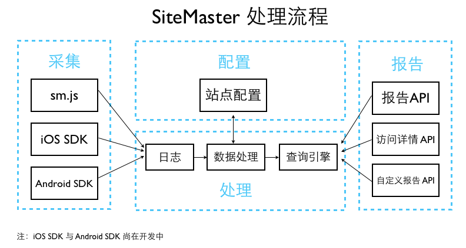

# {{ page.title }}

SiteMaster 的流程逻辑如下图：

API 部分包括管理 API 和报告 API，管理 API 包括

1. [站点管理 API](site.html)
2. [用户管理 API](site_user.html)

报告 API 包括

1. [报告API](site_report.html)
2. [数据银行 API](site_databank.html)

所有的 API 请求都需通过 OAuth2.0 认证，详情请参见 [OpenMaster 详细文档](http://dev.admaster.com.cn/doc/openmaster/v1/cn/index.html)
