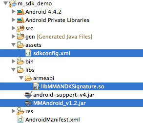

# MMA 通用 SDK 部署指南

## 简介

以往，要监测 APP 中广告的曝光、点击等数据，需要加入第三方广告监测公司的 SDK，如果不同广告主使用了不同的第三方广告监测，需要加多个公司的监测 SDK，无疑增加了成本和风险。现在，只需添加一次 MMA(中国无线营销联盟)通用 SDK，即可满足所有 MMA 成员中所有第三方监测公司的监测需求，同时 SDK 内部的调用方法保持一致，同时降低了开发成本。

## 步骤1：添加 MMA Android SDK 到工程中

* 将 MMA SDK 的 `MMAndroid_v1.2.jar` 拷贝到 libs 目录下并添加为 JAR 包；
* 将`libMMANDKSignature.so` 拷贝到 libs\armeabi 目录下；
* 把`sdkconfig.xml`配置文件拷贝到工程里的assets目录下。

对于Eclipse工程，请参照下面的步骤添加 JAR 包：

1.	在 “Package Explorer” 窗口中右击你的工程并选择 “Properties”
2.	在左侧面板中选择 “Java Build Path”
3.	在主窗口中选择 “Libraries”页签
4.	点击“Add JARs…”按钮
5.	选择您拷贝到libs目录下的 mma_sdk.jar
6.	点击 “OK” 完成添加。

## 步骤2：修改 AndroidManifest.xml 文件

修改 AndroidManifest.xml 文件，新增网络连接请求和读取手机状态的权限：

{:.prettyprint}
    <uses-permission android:name="android.permission.INTERNET" />
    <uses-permission android:name="android.permission.ACCESS_WIFI_STATE" />
    <uses-permission android:name="android.permission.ACCESS_NETWORK_STATE" />
    <uses-permission android:name="android.permission.ACCESS_COARSE_LOCATION" />
    <uses-permission android:name="android.permission.READ_PHONE_STATE" />
    

## 步骤3：为广告添加监测代码

在有广告监测需求的 Activity 中的  onStart() 方法中调用 `Countly.sharedInstance().init(this, CONFIG_URL);  ` 进行初始化,其中 `CONFIG_URL` 为远程配置文件的地址，当广告产生曝光时，控制触发以下代码

    String TEST_TRACKING_URL = "http://admaster.mobi/android/log/a222,c123,b132,";//TEST_TRACKING_URL 为对应的曝光代码
    Countly.sharedInstance().onExpose(TEST_TRACKING_URL);
    

当广告被点击时，控制触发以下代码

    String TEST_TRACKING_URL = "http://admaster.mobi/android/log/a222,c123,b132,";//TEST_TRACKING_URL 为对应的曝光代码
    Countly.sharedInstance().onClick(TEST_TRACKING_URL);

代码示例(具体请见 demo 项目源码)

{:.prettyprint}
    package com.mmandroid_demo;    

    import android.app.Activity;
    import android.os.Bundle;
    import android.view.View;
    import android.widget.Button;
    import cn.com.mma.mobile.tracking.api.Countly;
    import cn.com.mma.mobile.tracking.util.Logger;    

    /**
     * 此工程是为使用SDK的用户提供的demo
     * 
     * @author lincoln
     * 
     */
    public class MainActivity extends Activity {
       int count = 0;    

       /**
        * sdkconfig.xml配置文件服务器存放地址
        */
       public static final String CONFIG_URL = "http://admaster.mobi/sdkconfig.xml";
       /**
        * 点击监测地址
        */
       public static final String TEST_TRACKING_URL = "http://admaster.mobi/android/log/a222,c123,b132,";    

       @Override
       protected void onCreate(Bundle savedInstanceState) {
          super.onCreate(savedInstanceState);
          setContentView(R.layout.activity_main);    

          /**
           * 初始化SDK
           */
          Countly.sharedInstance().init(this, CONFIG_URL);    

       }    

       /**
        * 点击广告，发送消息
        */
       public void sendClickMsg(View view) {
          Countly.sharedInstance().onClick(TEST_TRACKING_URL);
       }
       /**
        * 曝光广告，发送消息
        */
       public void sendExposeMsg(View view) {
          Countly.sharedInstance().onExpose(TEST_TRACKING_URL);
       }    

    }

## 步骤4：验证和调试

## 附：xml 配置文件参数说明

sdkconfig.xml具体说明：  

{:.prettyprint} 
	<?xml version="1.0" encoding="UTF-8"?>  
	<config xsi:noNamespaceSchemaLocation="SDKSchema.xsd" xmlns:xsi="http://www.w3.org/2001/XMLSchema-instance" >
    <!--媒体平台相关配置-->
    <!--缓存队列设置-->
    <offlineCache>
        <!--建议 length * timeout <=iteration -->
        <!--队列长度，达到此队列长度时自动提交-->
        <length>5</length>
        <!--发送超时时间，单位为秒-->
        <queueExpirationSecs>10</queueExpirationSecs>
        <timeout>3</timeout>
    </offlineCache>

    <companies>
        <company>
            <name>admaster</name>
            <domain>
                <url>admaster.com.cn</url>
            </domain>
            <!--签名功能包所用的参数，如未设置，不使用签名功能-->
            <signature>
                <publicKey>Z83476Hel</publicKey>
                <paramKey>sign</paramKey>
            </signature>
            <switch>
                <isTrackLocation>true</isTrackLocation>
                <offlineCacheExpiration>86400</offlineCacheExpiration>
                <encrypt>
                    <MAC>md5</MAC>
                    <IDA>md5</IDA>
                    <IMEI>md5</IMEI>
                    <ANDROIDID>raw</ANDROIDID>
                </encrypt>
            </switch>
            <config>
                <arguments>
                    <!--argument的必选和常用可选参数 key需确定-->
                    <!--必选函数-->
                    <argument>
                        <key>OS</key>
                        <value>os</value>
                        <urlEncode>true</urlEncode>
                        <isRequired>true</isRequired>
                    </argument>

                    <argument>
                        <key>TS</key>
                        <value>t</value>
                        <urlEncode>true</urlEncode>
                        <isRequired>true</isRequired>
                    </argument>

                    <argument>
                        <key>MAC</key>
                        <value>n</value>
                        <urlEncode>true</urlEncode>
                        <isRequired>true</isRequired>
                    </argument>

                    <argument>
                        <key>IDFA</key>
                        <value>q</value>
                        <urlEncode>true</urlEncode>
                        <isRequired>true</isRequired>
                    </argument>

                    <argument>
                        <key>IMEI</key>
                        <value>imei</value>
                        <urlEncode>true</urlEncode>
                        <isRequired>true</isRequired>
                    </argument>
                    <argument>
                        <key>ANDROIDID</key>
                        <value>aid</value>
                        <urlEncode>true</urlEncode>
                        <isRequired>true</isRequired>
                    </argument>

                    <argument>
                        <key>WIFI</key>
                        <value>w</value>
                        <urlEncode>true</urlEncode>
                        <isRequired>true</isRequired>
                    </argument>

                    <argument>
                        <key>AKEY</key>
                        <value>x</value>
                        <urlEncode>true</urlEncode>
                        <isRequired>true</isRequired>
                    </argument>

                    <argument>
                        <key>ANAME</key>
                        <value>y</value>
                        <urlEncode>true</urlEncode>
                        <isRequired>true</isRequired>
                    </argument>
                    <!--可选函数-->
                    <argument>
                        <key>SCWH</key>
                        <value>scwh</value>
                        <urlEncode>true</urlEncode>
                        <isRequired>true</isRequired>
                    </argument>

                    <argument>
                        <key>OPENUDID</key>
                        <value>o</value>
                        <urlEncode>true</urlEncode>
                        <isRequired>true</isRequired>
                    </argument>
                    <argument>
                        <key>ODIN</key>
                        <value>odin</value>
                        <urlEncode>true</urlEncode>
                        <isRequired>true</isRequired>
                    </argument>

                    <argument>
                        <key>TERM</key>
                        <value>r</value>
                        <urlEncode>true</urlEncode>
                        <isRequired>true</isRequired>
                    </argument>

                    <argument>
                        <key>OSVS</key>
                        <value>q</value>
                        <urlEncode>true</urlEncode>
                        <isRequired>true</isRequired>
                    </argument>

                    <argument>
                        <key>LBS</key>
                        <value>l</value>
                        <urlEncode>true</urlEncode>
                        <isRequired>true</isRequired>
                    </argument>
                    <argument>
                        <key>MUID</key>
                        <value>muid</value>
                        <urlEncode>true</urlEncode>
                        <isRequired>true</isRequired>
                    </argument>
                    <argument>
                        <key>MUDS</key>
                        <value>muds</value>
                        <urlEncode>true</urlEncode>
                        <isRequired>true</isRequired>
                    </argument>
                </arguments>
                <events>
                    <event>
                        <!--<name>m1</name>-->
                        <key>start</key>
                        <value>m201</value>
                        <urlEncode>true</urlEncode>
                    </event>
                    <event>
                        <!--<name>e1</name>-->
                        <key>end</key>
                        <value>m203</value>
                        <urlEncode>true</urlEncode>
                    </event>

                </events>

            </config>
            <separator>,</separator>
            <!--<separator>&amp;</separator>-->
            <equalizer></equalizer>
            <!--如果设置true   timeStamper使用秒-->
            <timeStampUseSecond>true</timeStampUseSecond>
        </company>

        <!--其他检测公司配置-->
        <!--<company>-->
        <!--<name>miaozhen</name>-->
        <!--.....-->
        <!--</company>-->
        <company>
            <name>miaoz</name>
            <domain>
                <url>miaoz.com.cn</url>
            </domain>
            <!--签名功能包所用的参数，如未设置，不使用签名功能-->
            <signature>
                <publicKey>Z83476Hel</publicKey>
                <paramKey>sign</paramKey>
            </signature>
            <switch>
                <isTrackLocation>false</isTrackLocation>
                <offlineCacheExpiration>
                    86400
                </offlineCacheExpiration>
                <encrypt>
                    <MAC>raw</MAC>
                    <IDA>raw</IDA>
                    <IMEI>raw</IMEI>
                    <ANDROIDID>raw</ANDROIDID>
                </encrypt>
            </switch>
            <config>
                <arguments>
                    <!--argument的必选和常用可选参数 key需确定-->
                    <!--必选函数-->
                    <argument>
                        <key>OS</key>
                        <value>os</value>
                        <urlEncode>true</urlEncode>
                        <isRequired>true</isRequired>
                    </argument>

                    <argument>
                        <key>TS</key>
                        <value>t</value>
                        <urlEncode>true</urlEncode>
                        <isRequired>true</isRequired>
                    </argument>
                    <argument>
                        <key>MAC</key>
                        <value>n</value>
                        <urlEncode>true</urlEncode>
                        <isRequired>true</isRequired>
                    </argument>
                    <argument>
                        <key>IDFA</key>
                        <value>q</value>
                        <urlEncode>true</urlEncode>
                        <isRequired>true</isRequired>
                    </argument>

                    <argument>
                        <key>IMEI</key>
                        <value>imei</value>
                        <urlEncode>true</urlEncode>
                        <isRequired>true</isRequired>
                    </argument>
                    <argument>
                        <key>ANDROIDID</key>
                        <value>aid</value>
                        <urlEncode>true</urlEncode>
                        <isRequired>true</isRequired>
                    </argument>

                    <argument>
                        <key>TERM</key>
                        <value>r</value>
                        <urlEncode>true</urlEncode>
                        <isRequired>true</isRequired>
                    </argument>
                    <argument>
                        <key>WIFI</key>
                        <value>w</value>
                        <urlEncode>true</urlEncode>
                        <isRequired>true</isRequired>
                    </argument>

                    <argument>
                        <key>AKEY</key>
                        <value>x</value>
                        <urlEncode>true</urlEncode>
                        <isRequired>true</isRequired>
                    </argument>

                    <argument>
                        <key>ANAME</key>
                        <value>y</value>
                        <urlEncode>true</urlEncode>
                        <isRequired>true</isRequired>
                    </argument>
                    <!--可选函数-->
                    <argument>
                        <key>SCWH</key>
                        <value>scwh</value>
                        <urlEncode>true</urlEncode>
                        <isRequired>false</isRequired>
                    </argument>

                    <argument>
                        <key>OPENUDID</key>
                        <value>o</value>
                        <urlEncode>true</urlEncode>
                        <isRequired>false</isRequired>
                    </argument>
                    <argument>
                        <key>ODIN</key>
                        <value>odin</value>
                        <urlEncode>true</urlEncode>
                        <isRequired>false</isRequired>
                    </argument>

                    <argument>
                        <key>OSVS</key>
                        <value>q</value>
                        <urlEncode>true</urlEncode>
                        <isRequired>false</isRequired>
                    </argument>

                    <argument>
                        <key>LBS</key>
                        <value>l</value>
                        <urlEncode>true</urlEncode>
                        <isRequired>false</isRequired>
                    </argument>

                </arguments>
                <events>
                    <event>
                        <!--<name>m1</name>-->
                        <key>start</key>
                        <value>201</value>
                        <urlEncode>true</urlEncode>
                    </event>
                    <event>
                        <!--<name>e1</name>-->
                        <key>end</key>
                        <value>203</value>
                        <urlEncode>true</urlEncode>
                    </event>

                </events>

            </config>
            <separator>&amp;</separator>
            <!--<separator>&amp;</separator>-->
            <equalizer>=</equalizer>
        </company>

    </companies>
	</config>
